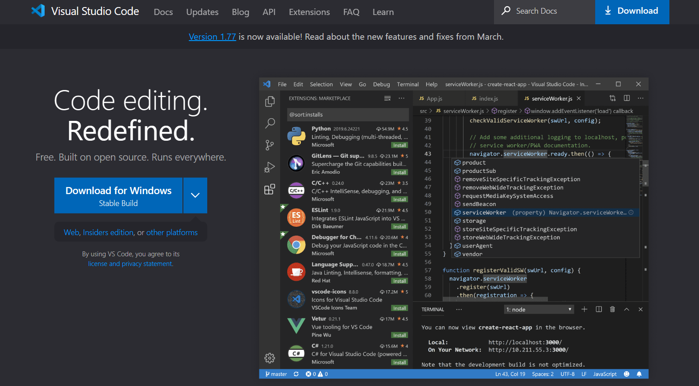

The beginning of the lab was to install Visual Studio Code. I had already installed Visual studio code,
but the way you would do it is by going to their website and pressing install. After you press install, go through all of the steps you are given to complete
the setup on your device, and get ready to make use of its terminal. You may download any languages to run on VSCODE later, but they are not necessary for this assignment. 

Next, you need to install git from the following link. https://gitforwindows.org/. Using the default settings should work just fine. If you want to check to make sure it is installed use the command git --version in the terminal.

Next is the hard part. First, go to the link https://sdacs.ucsd.edu/~icc/index.php and update your password. After you have the password updated, enter your
course specific username / email 
