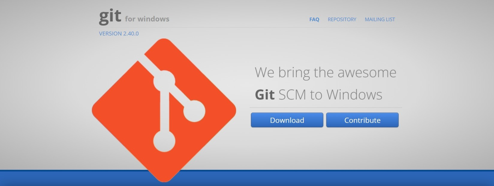

The beginning of the lab was to install Visual Studio Code. I had already installed Visual studio code,
but the way you would do it is by going to their website and pressing install. After you press install, go through all of the steps you are given to complete
the setup on your device, and get ready to make use of its terminal. You may download any languages to run on VSCODE later, but they are not necessary for this assignment. 

Next, you need to install git from the following [link.](https://gitforwindows.org/.) Using the default settings should work just fine. If you want to check to make sure it is installed use the command git --version in the terminal. Open the git terminal in VSCODE through Command Pallette -> select default profile -> git bash. 

Next is the hard part. First, go to the [link](https://sdacs.ucsd.edu/~icc/index.php) and update your password.  REMEMBER THIS PASSWORD. After you have the password updated, enter ssh and your course specific username / email into the git terminal. Answer yes to the question you are asked and enter your password (it is working, it just does not show.) 

It may take awhile for your password to work, but when it does you should see something like this 

Congratulations on completing the hard part, now to have fun experimenting with some commands! (some possible commands shown below)
(you can find a list of terminal commands [here](https://www.gnu.org/software/bash/manual/bash.html), but you should be mostly using cd, ls, pwd, mkdir, and cp

breakdown of commands shown above:

pwd: pretty straight forward, just prints the working directory

cat: cat serves only to output the contents of hello.txt in this case

ls -lat: this one is a little more comples to break down. ls by default lists the files in the current working directory, but in this case also outputs a lot of information about the files because of the -l modifier. The a modifier made sure that it displayed all files, even hidden ones. Lastly, the t modifier displayed the filed in order of what was most recently modified.
