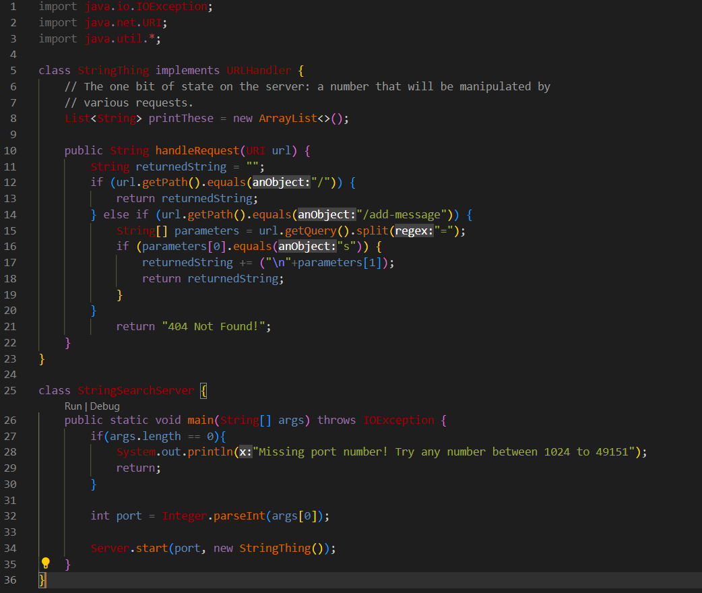
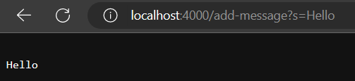
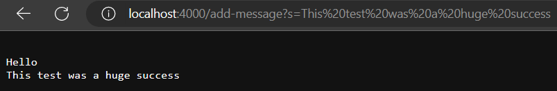

<h2>Part One</h2>

For this lab report, I had to make a server called StringSearch that would accept strings as inputs to be added.

Here is the code that I used to create a server:



Example of code running:



In the above example, the method handleRequest is called. It is called with the argument add-message?s=Hello, which is important because this is the way the url must be written in order to print Hello. The field returnedString is updated to be "Hello\n", as in accordance with the add-message specification in the path.

Example of code running:



In the above example, the method handleRequest is called again. The difference between this and the last one is that the returnedString is already "Hello\n" to start since it was changed the last time the method was called. Using the same logic as the previous example, the string is modified to be "Hello\nThis test was a huge success\n"

<h2>Part Two</h2>

The next part of the lab was to show one of the buggy codes that we fixed. I have chosen the following broken code because it was similar to a problem on my CSE12 quiz.
```
 static void reverseInPlace(int[] arr) {
    for(int i = 0; i < arr.length; i += 1) {
      arr[i] = arr[arr.length - i - 1];
    }
  }
```

This code does not work because it reverses the array twice by iterating over the entire length of the list and flipping the elements continuously. Hence, the following tester will pass despite the bug due to it being symmetrical.
```
@Test 
	public void testReverseInPlace() {
    int[] input1 = { 3, 5, 3 };
    ArrayExamples.reverseInPlace(input1);
    assertArrayEquals(new int[]{ 3, 5, 3 }, input1);
	}
```
Given a test that is not symmetrical, however, the function will fail. For example, in the following test reverseInPlace incorrectly returns { 3, 5, 7 }
```
@Test 
	public void testReverseInPlace() {
    int[] input1 = { 3, 5, 7 };
    ArrayExamples.reverseInPlace(input1);
    assertArrayEquals(new int[]{ 7, 5, 3 }, input1);
	}
 ```
