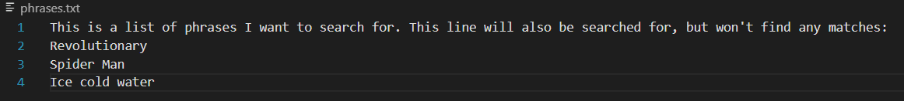

<h2>Researching Commands</h2>
The command I will be researching is grep. The method I will be using to find alternative ways to use is is the grep --help command.

<h3>-f</h3>
-f takes in two file names as parameters, and essentially searches for each line of file one in file two using grep. You can use this to search for a large amount of phrases at once, as I do here:

*bash command*

 
*phrases.txt*

*f-output.txt*

changing the parameters to words that are not in the file results in nothing being in the file, as shown below

*bash command*

 
*phrases.txt*

*f-output.txt*
