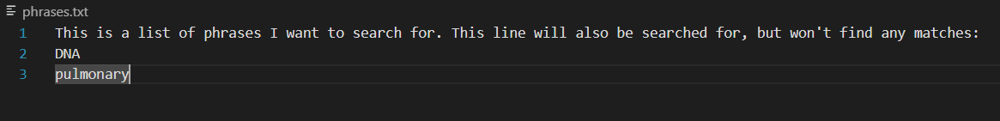
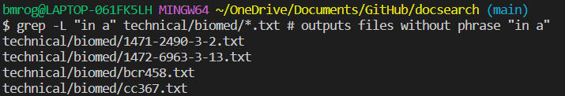

<h2>Researching Commands</h2>
The command I will be researching is grep. The method I will be using to find alternative ways to use is is the grep --help command.

<h3>-f</h3>
-f takes in two file names as parameters, and essentially searches for each line of file one in file two using grep. You can use this to search for a large amount of phrases at once, as I do here:

changing the parameters to words that are not in the file results in nothing being in the file, as shown below

sources used: chatGPT, grep --help

<h3>-l</h3>
-l outputs the names of the files that have the search words in them. For example, using l in combination with -f as in the prior example:

-l can also be used by itself, such as here where I search through all biomed to find the ones that mention ribosomes

sources used: grep --help

<h3>-L</h3>
-L is very similar to -L, the only difference being that it finds the files that DONT contain the given phrase.

files are very large, so only one doesn't contain the letter z

files are very large, but still a few don't contain "in a"

sources used: grep --help

<h3>-m</h3>

-m is helpful if there are a large amount of lines containing the same phrase, it stops returning lines after a specified number of returns.

