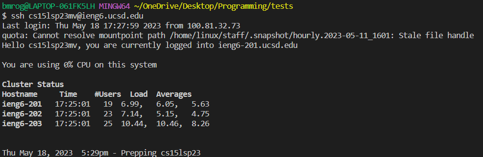
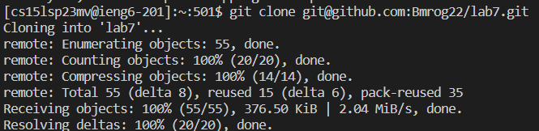
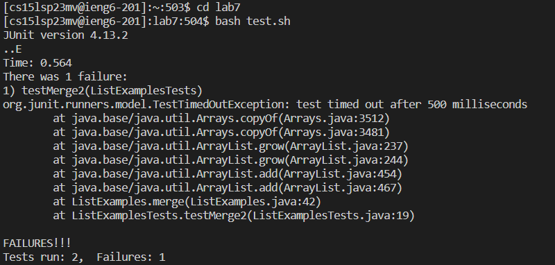
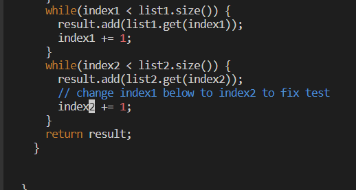
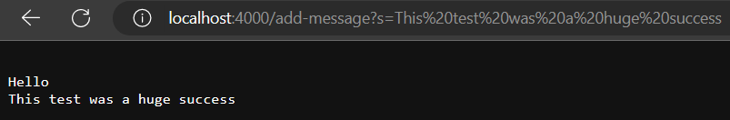
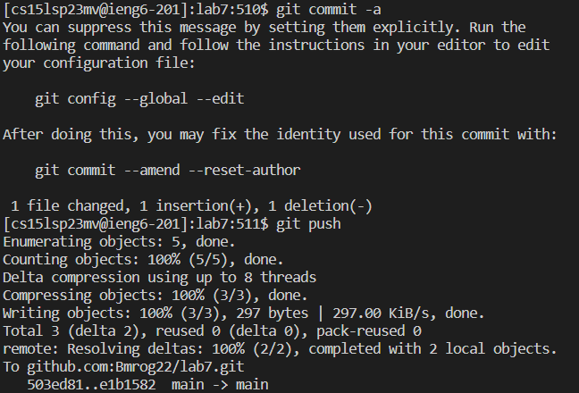

<h2>Lab Report 4</h2>

<h3>Step 4</h3>

Keys pressed: `s s h c s 1 5 l s p 2 3 m v @ u c s d . e d u <enter>`
  
What I did: connected to my account
  
Picture: 
  

<h3>Step 5</h3>
  
Keys pressed: `g i t <space> c l o n e <right-click> <enter>`
  
What I did: I used the git clone commad to paste in my link that I had copied
  
Picture: 
  

  
<h3>Step 6</h3>
  
Keys pressed: `c d <space> l <tab> <enter> b a s h <space> t <tab> <enter>`
  
What I did: I changed into the lab directory and then I used bash to run the testing file and tabbed to use less characters
  
Picture: 
  

  
<h3>Step 7</h3>
  
Keys pressed: `v i m <space> L <tab> . <tab> <enter> / a n g e <enter> j x i 2 <esc> :wq <enter>`
  
What I did: I used vim to enter the file and changed it based on where change was using search
  
Picture: 
  

  
<h3>Step 8</h3>
  
Keys pressed: `<up> <up> <enter>`
  
What I did: I reused the test command from earlier
  
Picture: 
  

  
<h3>Step 9</h3>
  
Keys pressed: `g i t <space> c o m m i t <space> - a <enter> i h i <esc> : w q <enter> g i t <space> p u s h <enter>`
  
What I did: I committed my changes and pushed them to my forked repository
  
Picture: 
  

