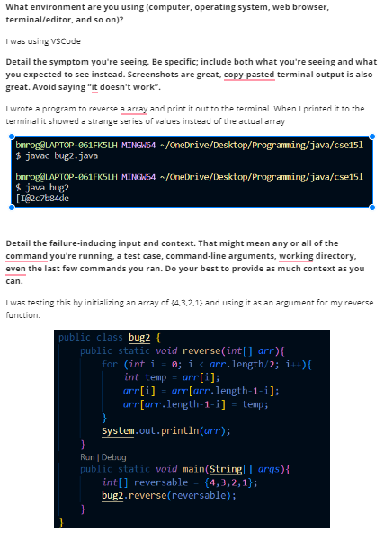
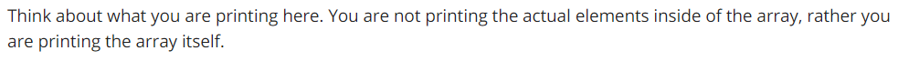
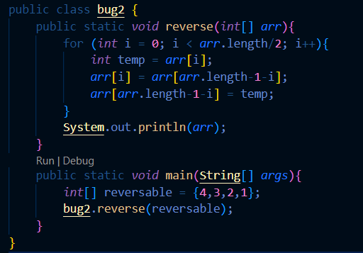
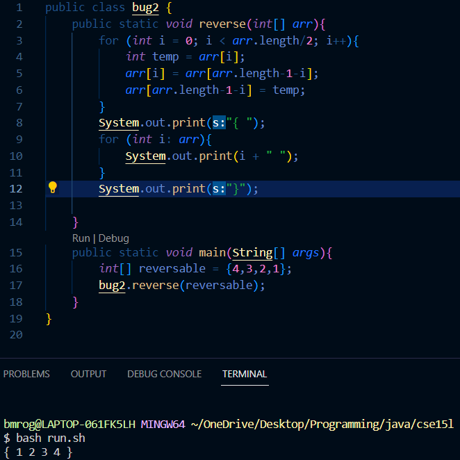

<h2>Lab Report 5</h2>

<h3>Step 1</h3>

My post:

TA response:

Info needed:

File structure: The code is in a folder by itself so you can just compile and run as normal using a bash script

Contents of file: Switch 

 

to 

How the bug was triggered: just by running the file as normal

What fixed the bug: to fix the bug, it is necessary to iterate through the list printing each element inside of it.

<h3>Step 2</h3>

What I learned from this lab in particular is exactly what the series of characters meant when I printed the array. I always knew you could not print an array like this but I did not know that it actually showed that data type of the array. (The I at the second character shows that it is an array of integers.
